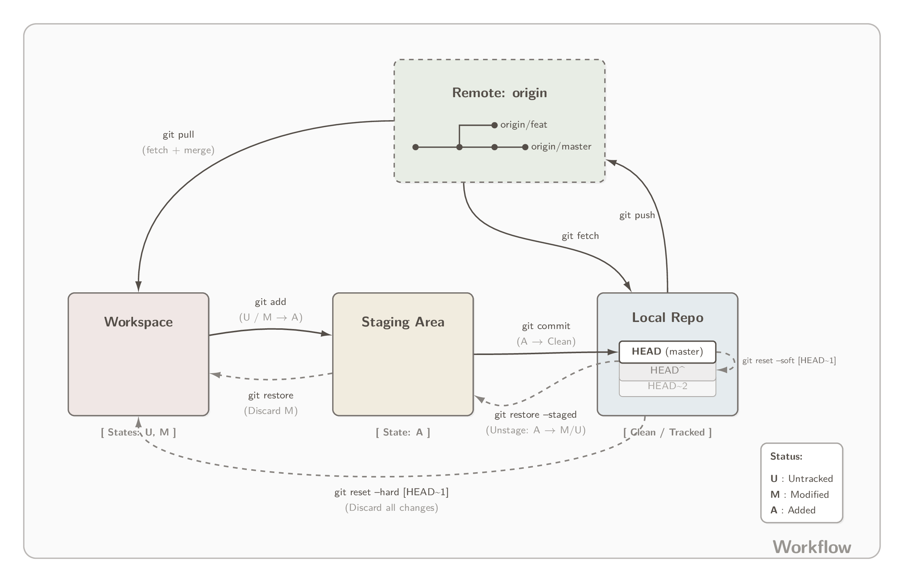
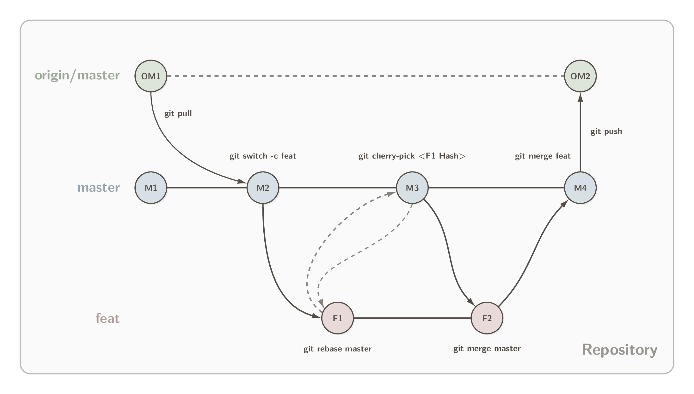
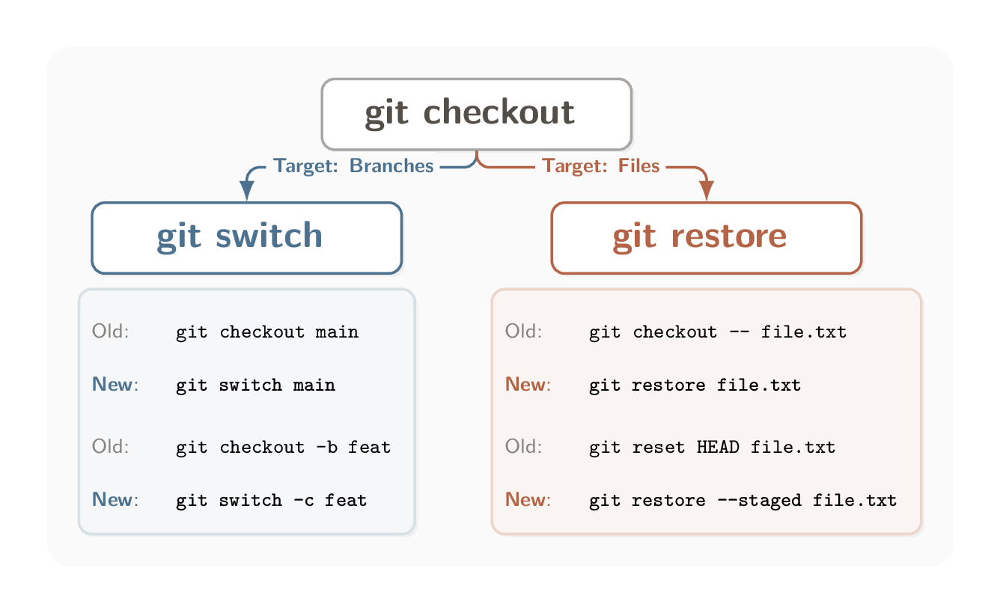

# GitHub 认证

## 1. 身份信息配置

此身份信息用于 commit 记录显示作者，并不涉及登录权限。

```sh
git config --global user.name "YourName"
git config --global user.email "your@example.com"
git config --global init.defaultBranch master        # 默认分支设为 master
```

## 2. 身份认证

方案 A：HTTPS + 凭据管理器

首次 `git push/pull 时`，在弹窗中输入用户名和 PAT (Personal Access Token) 即可

Windows: `git config --global credential.helper manager`
macOS: `git config --global credential.helper osxkeychain`

方案 B：SSH Key

```sh
# 1. 生成密钥
ssh-keygen -t ed25519 -C "your@example.com"

# 2. 复制公钥内容并添加到 GitHub (Settings -> SSH keys)
cat ~/.ssh/id_ed25519.pub

# 3. 验证连接
ssh -T git@github.com
```

--- 

## 3. Git 指令笔记

### 3.1 Git Workflow


工作流：工作区 (Workspace) ➔ 暂存区 (Staging Area/Index) ➔ 本地仓库 (Local Repo) ➔ 远端仓库 (Remote)。

<div align="center">
  
</div>

**撤销操作**：`git restore` 意思是撤销工作区的修改，`git restore --staged` 意思是撤销暂存但不丢弃修改。

---

### 3.2 分支模型与远端交互 (Branching Model)

分支模型：master, feat, orgin/master 

<div align="center">
  
</div>

图中 `git cherry-pick <Hash>` 可以跨分支复制单个指定的 Commit Hash，`git rebase` 可以在不改变节点的前提下改变分支起点。

---

### 3.3 checkout & switch & restore

Git 2.23 版本引入 `git switch` 和 `git restore` 旨在替代 `git checkout` 的Branching 和 Files 两个方面的职责。

<div align="center">
  
</div>


