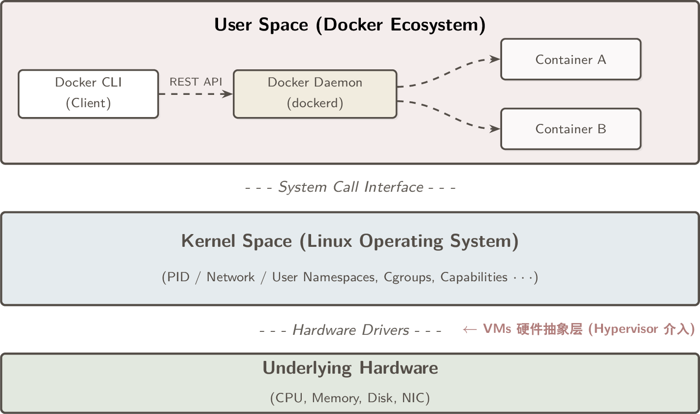
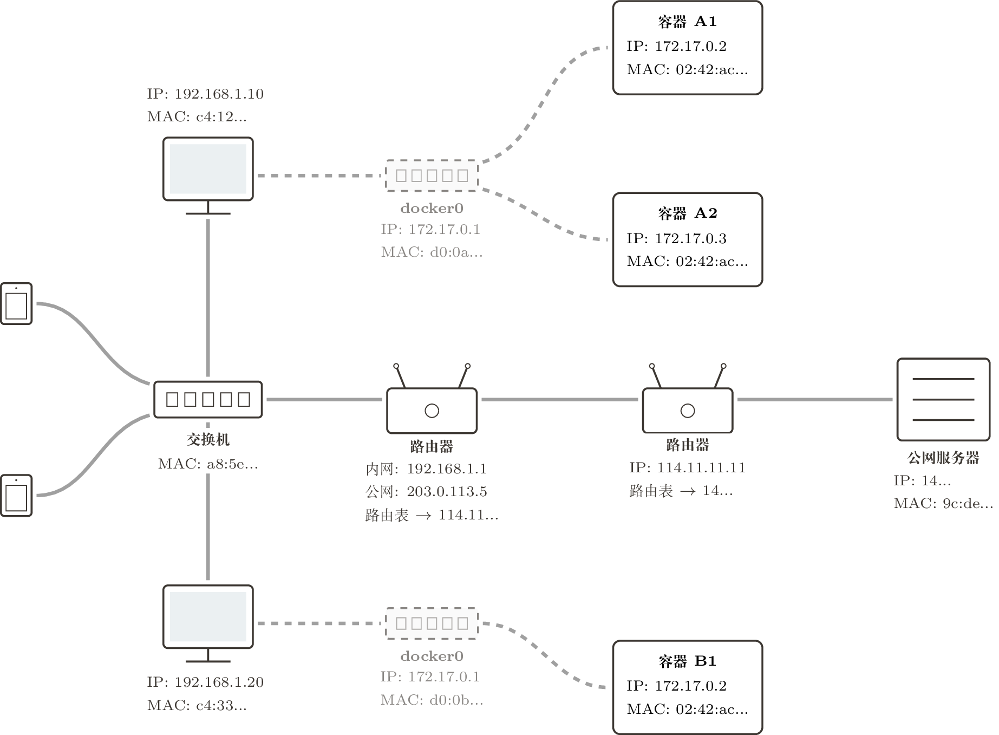
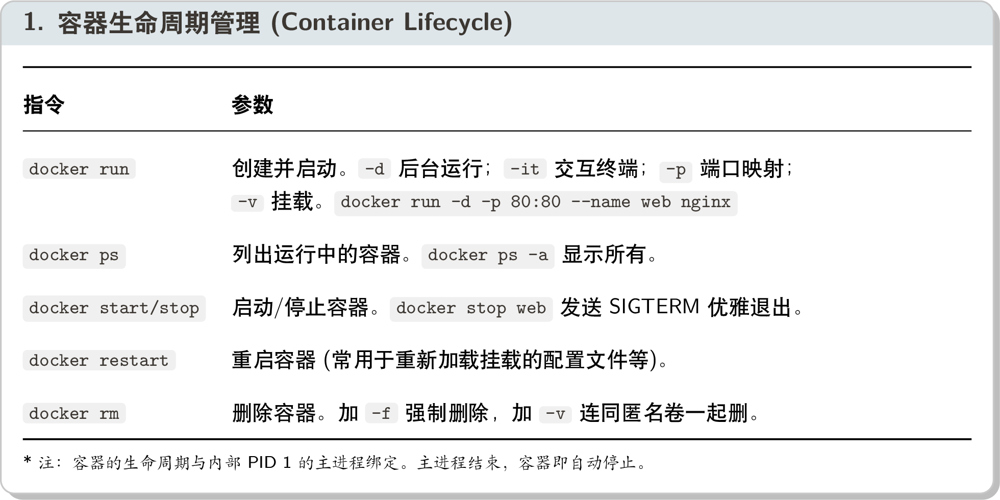
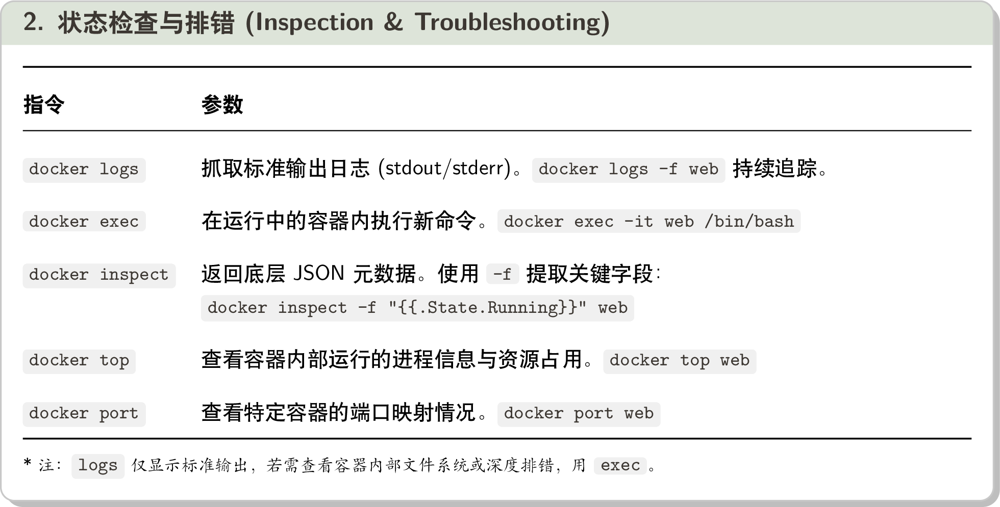
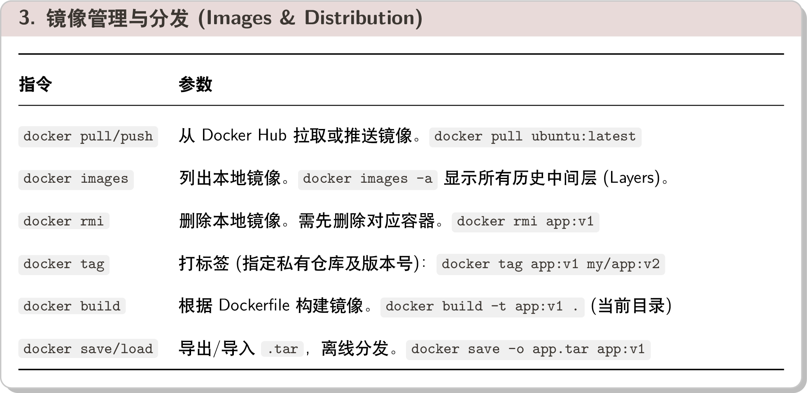
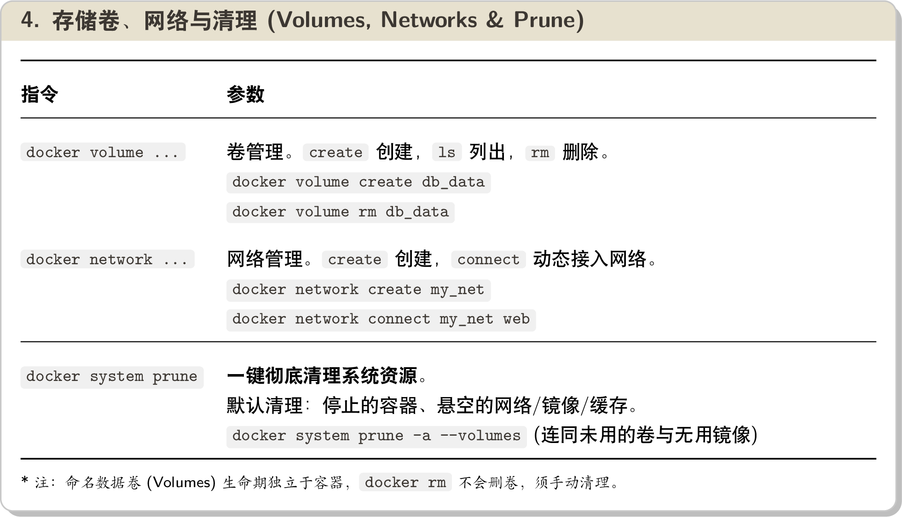

# Architecture & Principles 架构原理

Docker 本身并不是虚拟化技术，而是利用 Linux 内核现有的特性（Namespaces, Cgroups, UnionFS 等）封装出来的一套“物流/隔离”系统（Containerization）。

<div align="center">
    
</div>

## 1 Containers 容器 vs. Virtual Machines 虚拟机

> *Containers provide isolated process contexts, not whole system virtualization.*

Docker 容器的核心思想是**进程隔离**，而非系统虚拟化。借助 Linux 的 PID Namespace 机制，每个容器都拥有独立的 PID 空间（内部进程拥有独立的 PID 1），与其他容器及宿主机互不干扰。

- 虚拟机 (VMs)：提供**硬件级别的抽象**（Hardware abstractions），需要运行完整的冗余操作系统，启动慢、资源开销大。
- 容器 (Containers)：直接与宿主机的 Linux 内核交互。容器本质上只是宿主机中一个**受限制**的常规进程。

## 2 Images 镜像 & Layers 层

> *The files available to a container are the union of all layers in the lineage of the image that the container was created from.*

容器的运行依赖于**联合文件系统 (UnionFS)**（如 OverlayFS, AUFS）。Docker 镜像并非单文件，而是由一系列的层（Layers）组合而成：

- **只读层与可写层**：Docker 会将多个底层镜像（只读）和一个顶层容器层（可写）合并为一个统一的文件系统视图。
- **写时复制 (Copy-on-Write)**：当容器需要修改文件时，Docker 会先将该文件从只读层复制到最顶部的可写层（Writable layer），随后的修改都在此进行。
- **文件删除机制**：在容器中删除底层文件时，并非真正擦除数据，而是在顶层可写层写入一个“删除标记”（Delete record / Whiteout），在视图层面将该文件隐藏。

## 3 Mounts 挂载 & Volumes 卷

Linux 提供 MNT Namespace 实现挂载点隔离。由于容器销毁后可写层会完全丢失，数据的持久化与共享必须依赖以下机制：

1. **卷 (Volumes)**：由 Docker 管理，存储于 `/var/lib/docker/volumes/`，支持跨容器共享（通过 `--volumes-from`）。
2. **绑定挂载 (Bind mounts)**：将宿主机的目录映射进容器（如 `-v /host/path:/container/path`）。不受 Docker 管理，更加灵活但容易有权限问题。
3. **内存挂载 (tmpfs)**：将数据存入物理内存。读写极快，适用于存放高频缓存或敏感机密数据（如密钥）。

## 4 Networking 网络

> *Docker abstracts the underlying host-attached network from containers. Doing so provides a degree of runtime environment agnosticism.*

Docker 将底层的宿主网络与容器剥离开来，赋予应用极高的运行环境不可知性。借助 Network Namespace 和虚拟以太网对（veth pairs），Docker 提供了三种基础网络模式：

- **桥接网络 (Bridge)**：默认模式。容器连接到虚拟网桥 docker0，通过 NAT 访问外网。
- **主机网络 (Host)**：容器共享宿主机网络栈。性能较好但缺乏隔离（容易与其他同样模式的容器冲突导致无法启动）
- **无网络 (None)**：容器没有虚拟网卡，只有一个本地回环接口 `127.0.0.1`，适用于无需联网的高安全场景。

在最常用的 Bridge 模式下，Docker 解决内外网通信的核心是**NAT（网络地址转换）**与**端口发布（Port Publishing）**：

<div align="center">
    
</div>

> 1. 同主机容器间通信：依靠内部虚拟 MAC 地址，通过虚拟网桥 docker0 直达。（无需宿主机网卡介入）
> 2. 容器访问外部网络：通过 docker0 网桥转发到宿主机网卡 (NAT 为宿主机内网 IP)，再由宿主机网卡转发到路由器 (NAT 为路由器分配的公网 IP)。
> 3. 外部网络访问容器：必须通过 `-p 宿主机IP:映射端口` 映射端口，外部访问 `宿主机IP:映射端口` 时，由宿主机自动将流量转发（DNAT）至内部容器。

## 5 资源控制与安全隔离 (Cgroups & Security)

Docker 利用 Linux 的 Cgroups (Control Groups) 进行**资源配额**：

- CPU：通过 `--cpu-shares` 控制进程在 CPU 争抢时的相对调度权重；`--cpus` 控制每个调度周期内 CPU 时间上限，计算逻辑：
    $$
    CPU Limit = \frac{Quota}{Period}
    $$
- Memory：通过 `--memory` 限制可用物理内存总量，防止内存泄漏导致宿主机 OOM 雪崩。

Docker 利用 Linux 的 Capability 机制和 User Namespace（用户命名空间）机制实现更细粒度的**权限控制**：

- Capabilities：遵循最小权限原则，Docker 默认剥夺容器的大部分内核权限（如修改系统时间、调整网络栈等）。可通过 `--cap-add` 或 `--cap-drop` 微调。
- User Namespaces：通过启用 `--userns-remap`，将容器内的 root 用户（UID 0）在宿主机上映射为一个无特权的普通用户。

---

# Cheatsheet 指令速查

# Cheatsheet 指令速查

<div align="center">
    
    <br>
    
    <br>
    
    <br>
    
</div>

---

# Packaging & Automation 镜像打包

打包镜像的标准化做法是使用 Dockerfile，结合 CI/CD 流水线（如 Jenkins, GitHub Actions）实现自动化构建、测试和发布。以下是一些最佳实践：

## 1 Dockerfile 编写规范

Dockerfile 的本质是将环境配置过程代码化 (Infrastructure as Code)。每个指令都会在构建过程中生成一个新的只读镜像层，并被积极缓存以加速后续构建。

编写前要配置 .dockerignore 文件以排除无关代码（如 .git, node_modules），减少上下文传输和构建时间。

1. 环境与文件系统指令简介
    ```dockerfile
    FROM node:18-alpine AS builder                                          # 指定基础镜像，推荐使用官方精简版（如 alpine）以减小体积
    LABEL maintainer="gew" version="1.0" description="A sample Node.js app" # 添加元数据标签
    ENV NODE_ENV=production                                                 # 设置环境变量
    WORKDIR /app                                                            # 设置容器内的工作目录（省得 RUN cd /app）
    COPY package*.json ./                                                   # 先复制依赖文件，利用 Docker 缓存加速安装
    ADD . .                                                                 # 相当于加强版的 COPY，支持 URL 和自动解压缩 .tar.gz 文件
    VOLUME ["/app/data"]                                                    # 在镜像中声明一个卷挂载点（不创建卷，只是声明匿名卷）
    ```

2. 执行与启动指令
    ```dockerfile
    RUN npm install --production    # （构建时）在当前镜像层上方启动一个临时容器执行命令，执行结束后提交 (commit) 为新的镜像层。
    ENTRYPOINT ["npm", "start"]     # 容器启动时执行的命令（不受 docker run 的命令行参数覆盖，除非使用 --entrypoint 覆盖）
    CMD ["node", "index.js"]        # 容器启动时执行的命令（可被 docker run 的命令行参数覆盖，如果定义了 ENTRYPOINT，则作为参数）
    ```

> 尽量使用 JSON 数组格式的指令，避免使用 shell 格式（如 `CMD npm start`），否则 Docker 会将其包裹在 `/bin/sh -c` 中执行，导致信号转发和环境变量解析等问题。

3. 高级指令

    ```dockerfile
    ARG NODE_VERSION=18-alpine                                  # 定义构建参数（Build-time variable），可在构建时通过 --build-arg 覆盖
    ONBUILD RUN npm install                                     # 定义一个在当前镜像被用作基础镜像时才会执行的指令（适用于构建公共基础镜像）
    HEALTHCHECK CMD curl -f http://localhost:3000/ || exit 1    # 定义容器健康检查命令，Docker 会定期执行该命令并根据返回值更新容器状态
    ```

多阶段构建：在同一个 Dockerfile 中定义多个 FROM 阶段，下个阶段可以选择前一个阶段的镜像作为基础镜像（如 `FROM builder AS runtime`），最终只保留最后阶段的镜像。


## 2 镜像打包最佳实践

- **前置校验 (Fail Fast)**：通过写一个 `startup.sh` 脚本作为 ENTRYPOINT，在启动主应用前，先校验依赖的服务（数据库端口、环境变量）是否就绪；
- **Init 进程收割僵尸进程**：Linux 中的 PID 1 进程负责转发信号和回收孤儿/僵尸进程。可以用 `docker run --init` 启动一个内置的 init 进程；
- **尽早降级**：通过 `USER nonroot_user` 指令切换到非 root 用户，避免容器内的安全风险；

## 3 镜像分发

- 托管仓库：Docker Hub（公共免费，私有收费），GitHub Container Registry（与 GitHub 生态集成），AWS ECR（与 AWS 生态集成）等。
- 自建 Registry：使用 `docker run -d -p 5000:5000 --restart=always --name registry registry:2` 启动一个本地 Registry 服务，默认监听 5000 端口。
- 离线分发：使用 `docker save` 将镜像导出为 tar 文件，传输后用 `docker load` 导入。

---

# Orchestration 多容器编排

当应用从单体变成微服务，需要同时运行 Web、数据库、缓存等数十个容器。在集群层面，我们不再直接操作“容器 (Container)”，而是操作“服务 (Service)”和“任务 (Task)”：

- 服务 (Service)：定义了一个应用组件的期望状态（如运行多少个副本、使用哪个镜像、暴露哪些端口）。编排工具会自动对齐当前状态与期望状态。
- 任务 (Task)：服务的一个实例，包含一个容器和它所在的节点。编排工具会根据服务定义自动调度任务到合适的节点上。

## 1 Compose vs. Swarm

在 Docker 生态中，有两个官方的编排工具，分别应对不同规模的场景：

- Docker Compose (单机编排)：适用于开发环境和小规模部署，通过 `docker-compose.yml` 定义多容器服务，支持依赖关系、环境变量、卷挂载等配置。

    ```sh
    docker-compose up -d    # 后台启动服务
    docker-compose down     # 停止并删除服务
    docker-compose logs     # 查看服务日志
    ```

- Docker Swarm (集群编排)：Docker 原生的集群管理工具，把多台物理机或虚拟机融合成一个巨大的“虚拟 Docker 主机。集群内有 Manager 和 Worker 两种节点。

    ```sh
    docker swarm init       # 初始化 Swarm 集群
    docker node ls          # 查看集群节点状态
    docker service create    # 创建服务
    docker service ls        # 查看服务状态
    ```

无论是 Compose 还是 Swarm，都采用声明式的配置方式。用户只需描述期望的服务状态（如运行多少个副本、使用哪个镜像、暴露哪些端口），编排工具会自动对齐当前状态与期望状态：

## 2 集群挂载与网络

- Configs (普通配置)：将 nginx.conf 等配置文件存储在集群中心。服务启动时，Docker 会自动将它作为普通文件挂载到容器内部。
- Secrets (敏感配置)：将数据库密码等敏感信息存储在集群中心。服务启动时，Docker 会自动将它作为 tmpfs 挂载到容器内部（只读且不持久化）。

- Overlay Network (覆盖网络)：一种跨主机的虚拟局域网。只要把容器加入同一个 Overlay 网络，它们就能像在同一台交换机上，通过“服务名”互相 Ping 通（内置 DNS 服务发现）。
- Routing Mesh (路由网格)：Swarm 集群内的每个节点都能接受外部请求，并自动将流量转发到运行目标服务任务的节点上（不需要用户关心服务实例分布在哪些节点）。