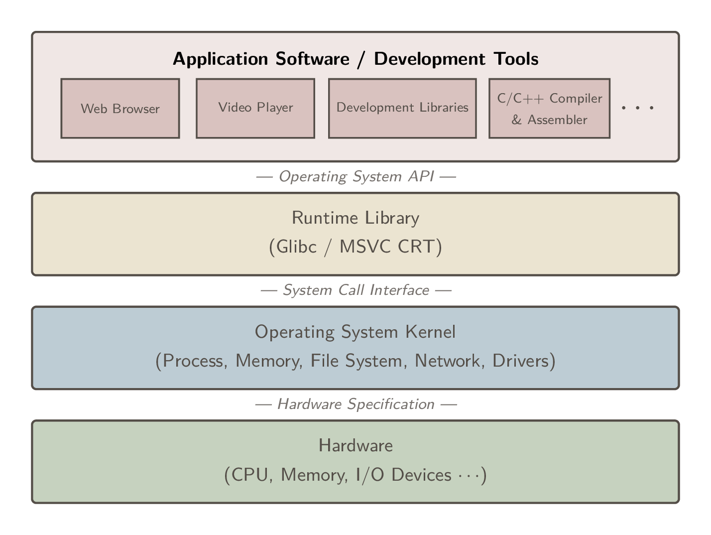

# 目标文件

## 1 计算机系统 Architecture Overview

计算机是个宽泛的概念，本笔记将范围限定在基于 x86-64 指令集架构的通用计算平台(PC 机)。
无论硬件怎么变，软件开发者只需关注三个核心部件：CPU、内存、I/O 控制芯片。

现代 CPU 频率基本被限制在 4GHz，为进一步提高效率，**多核处理器**应运而生。

> 计算机科学领域的任何问题都可以通过增加一个间接的中间层来解决。

计算机系统是从上到下严格分层的，每一层只和相邻的层通过接口(Interface)通信。这种设计保证了软硬件的解耦和向下兼容。



**运行库(Runtime Library)**使用操作系统提供的**系统调用接口(System call Interface)**,系统调用接口在实现中往往以软件中断(Software Interrupt)的方式提供,比如Linux使用0x80号中断作为系统调用接口。

所有的应用程序都以进程(Process)的方式运行在比操作系统权限更低的级别,每个进程都有自己独立的地址空间,使得进程之间的地址空间相互隔离。

操作系统的两大核心功能：提供接口和**管理硬件资源**。

1. CPU 管理：可抢占式(Preemptive)的分时系统(Time-Sharing System)
2. 硬件驱动：通过操作系统中的设备驱动(Device Driver)实现操作，驱动程序由硬件厂商根据**硬件规格(Hardware Specification)**进行开发。

程序通过**虚拟地址机制**实现内存隔离或共享：

1. 分段(Segmentation)：通过段表将虚拟地址与物理内存地址映射，解决了地址隔离和程序重定位问题。但由于是以程序为单位进行整体换入换出，磁盘 I/O 效率低。
2. 分页(Paging)：将虚拟空间分为固定大小的页，通过页表与物理内存地址映射。利用局部性原理按需触发页错误(Page Fault)，大大提高磁盘 I/O 效率。

每个线程有自己私有的寄存器、栈、TLS 线程局部存储，且线程之间共享进程内存。Linux 下并没有明确的线程概念，而是将执行实体称为 Task (任务)，可以视作运行单线程的进程。可以用 `fork` 创建一个与父任务共享内存的子任务（但写入时会发生 COW 写时复制），`fork` 和 `exec` 组合用来创建并运行新任务。可以用 `clone` 创建新线程：通过配置参数选择与父任务共享内存空间和文件等资源。

并发编程问题：

1. 单个 C 语言指令在汇编层面往往不是原子的 (Atomic)，需要锁等同步机制。
2. 编译器过度优化和 CPU 动态调度（乱序执行）会破坏同步机制，需要使用 barrier (内存屏障) 等机制来阻止换序以保证线程安全。

## 2 目标文件

### 2.1 编译和链接

在 Linux 下,当我们使用 gcc/g++ 来编译 C 语言程序时，过程可以分为四步：预处理、编译、汇编、链接。


预编译阶段主要负责处理源码中以 # 开头的指令。将宏定义展开、头文件包含、删除注释、添加行号和文件名标识，但保留 `#pragma` 编译器指令。

现代 gcc 将预编译和编译合并为一步，通过 cc1 程序完成（C++ 为 cc1plus）。编译阶段通过一系列词法分析、语法分析、语义分析及优化生成汇编代码文件，在汇编阶段将汇编代码转换成机器指令文件，也就是**目标文件**。

> 现代编译器通常以中间代码 (Intermediate Code) 为界分为前端和后端。前端负责解析源码并生成机器无关的中间代码；后端则针对具体的 CPU 架构，将中间代码转换为目标机器码，并进行指令级优化。

一个 .c/.cpp 源文件加上它包含的所有头文件，在预处理后就形成了一个编译单元 (Compilation Unit)。一个目标文件就是一个**模块**，它包含了该模块局部的机器指令、数据，以及等待被填补的“重定位信息”。

模块之间会通过函数调用和变量访问进行“通信”，这就需要**链接 (Linking)**。链接主要包括三个步骤：**地址和空间分配 (Address and Storage Allocation)**、**符号决议 (Symbol Resolution)**和**重定位 (Relocation)**。将所有目标文件中相互引用的符号地址修正。

在此过程中，链接器不仅要拼接我们自己写的模块，还需要接入外部依赖——最常见的就是**运行时库 (Runtime Library)**（如 glibc, libstdc++）。运行时库是支持程序运行的基础函数集合，库的本质其实就是一个压缩包，里面打包存放了大量最常用、已经编译好的目标文件（如 printf.o）。链接器会从中按需提取，与我们的程序合成一个完整的可执行文件。

### 2.2 目标文件

现在计算机平台上流行的可执行文件格式主要是 Windows / PE (Portable Executable) 和 Linux / ELF (Executable Linkable Format)，它们都是 COFF (Common File Format) 格式的变种。

COFF 的主要贡献是在目标文件里面引入了节 (Section) 机制，另外它还定义了标准化的符号表和行号信息，为调试奠定了基础。

| 目标文件类型 | 后缀 (Linux / Win) | 说明 |
| :--- | :--- | :--- |
| 可重定位文件<br>(Relocatable File) | Linux: `.o`<br>Win: `.obj` | 包含编译后的机器指令和数据，但不能直接运行。虚拟地址通常从 0 开始，需要与其他目标文件或库链接完成重定位。<br>*注：静态库（`.a` / `.lib`）本质上就是一堆可重定位文件的打包集合。* |
| 可执行文件<br>(Executable File) | Linux: 无后缀 / `a.out`<br>Win: `.exe` | 包含了可以直接被操作系统**装载**执行的程序。所有的符号决议和地址重定位都已完成，入口地址已确定。 |
| 共享目标文件<br>(Shared Object File) | Linux: `.so`<br>Win: `.dll` | 包含代码和数据，具备两种用途：<br>1. 静态链接：在编译时作为库被链接器读取。<br>2. 动态链接：在程序运行时，由动态链接器加载并映射到进程的虚拟地址空间。 |
| 核心转储文件<br>(Core Dump File) | Linux: `core` | 当进程意外崩溃（如发生 Segmentation fault）时，由内核生成的该进程当时的内存快照、寄存器状态等调试信息。用于 Glibc/GDB 的事后分析。 |

> 其他不太常见的有：Microsoft / OMF, Unix / out 和 MS-DOS / COM 等可执行文件格式。

#### 1. ELF 链接视图解析

在链接视图下，ELF 文件是由一个个“节 (Section)”拼接而成的。整个文件大致三部分：文件头 → 节头表 → 各种节。
分节可以实现：节权限隔离、提高 CPU 缓存命中率、进程之间共享节内存。

1. ELF 文件头 (ELF Header)

记录文件是否可执行、目标硬件（比如 x86-64）、大小端序、入口地址等，以及节头表在文件中的偏移位置。

```sh
file chat_server # 快速查看文件类型（可执行、架构、静态/动态链接）

readelf -h chat_server # 解析 ELF 文件头（魔数、入口地址等）
```

2. 节头表 (Section Header Table) **链接器最关心**

记录各个节的起始位置、长度和读写属性。

```sh
readelf -S chat_server # 查看节头表（列出所有节及其大小、偏移量、权限属性）

size chat_server # 查看节在运行时的体积大小（也就是段 Segment）
```

3. 节 (Sections)

编译器为了方便管理，把不同性质的二进制数据分别存放，以下四节最重要：

.text 代码节：记录编译后的机器指令。

.data 数据节：记录已初始化且初始值不为 0 的全局变量和局部静态变量。

.rodata 只读数据节：记录 const 变量和字符串常量。

.bss：记录未初始化或初始值为 0 的全局变量和局部静态变量。

> .bss 节在目标文件（磁盘）中不占空间，在程序运行时由操作系统根据节头表信息分配内存并清零。

```sh
objdump -d chat_server # 反汇编代码节（逆向工程）

# 以十六进制和 ASCII 码对照的方式，查看各个节的实际原始内容
objdump -x -s -d chat_server
```

此外还有链接与辅助节：

`.symtab` 符号表：记录函数名、全局变量名及其对应地址。

1. 本模块定义的全局函数 / 变量：可以提供给别的模块使用
2. 引用的外部模块的函数 / 变量

`.strtab` / `.shstrtab` 字符串表：字符串（如变量名、节名）都存在这里，其他地方通过“偏移量”来引用。

`.rel.text` / `.rel.data` 重定位表：记录了代码或数据中哪些是占位的“假地址”。

`.debug` 调试信息：包含行号、变量类型等信息（DWARF 格式），发布时用 `strip chat_server` 剥离。

`.comment` 注释信息：存放编译器版本字符串等说明信息。


---

# 静态链接