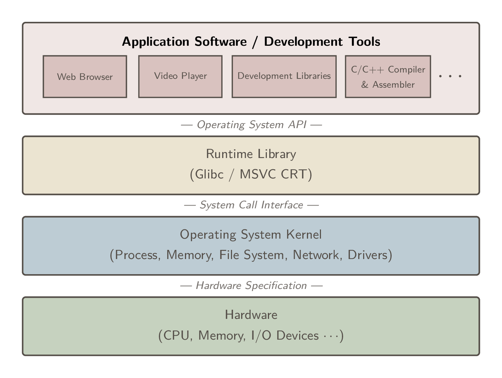
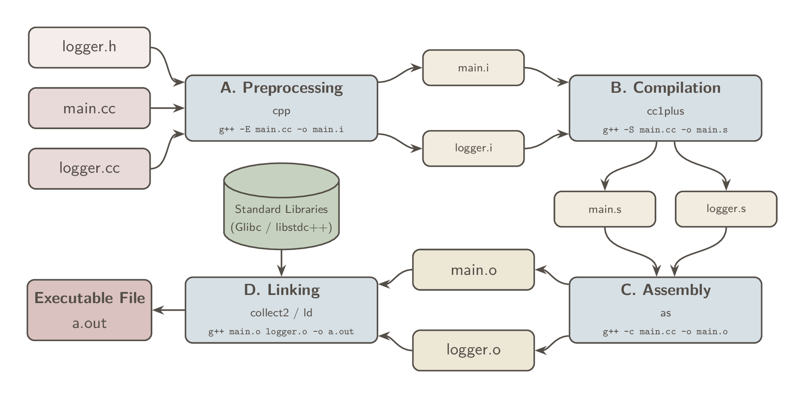
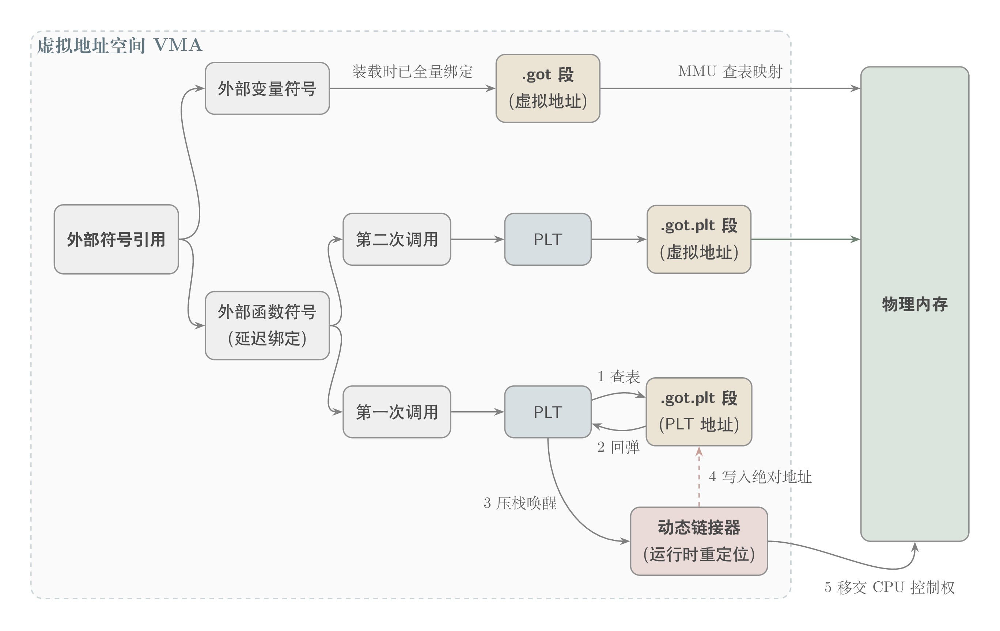

# 目标文件

## 1 计算机系统 Architecture Overview

计算机是个宽泛的概念，本笔记将范围限定在基于 x86-64 指令集架构的通用计算平台(PC 机)。
无论硬件怎么变，软件开发者只需关注三个核心部件：CPU、内存、I/O 控制芯片。

现代 CPU 频率基本被限制在 4GHz，为进一步提高效率，**多核处理器**应运而生。

> 计算机科学领域的任何问题都可以通过增加一个间接的中间层来解决。

计算机系统是从上到下严格分层的，每一层只和相邻的层通过接口(Interface)通信。这种设计保证了软硬件的解耦和向下兼容。

<div align="center">
  
</div>

**运行库(Runtime Library)**使用操作系统提供的**系统调用接口(System call Interface)**,系统调用接口在实现中往往以软件中断(Software Interrupt)的方式提供,比如Linux使用0x80号中断作为系统调用接口。

所有的应用程序都以进程(Process)的方式运行在比操作系统权限更低的级别,每个进程都有自己独立的地址空间,使得进程之间的地址空间相互隔离。

操作系统的两大核心功能：提供接口和**管理硬件资源**。

1. CPU 管理：可抢占式(Preemptive)的分时系统(Time-Sharing System)
2. 硬件驱动：通过操作系统中的设备驱动(Device Driver)实现操作，驱动程序由硬件厂商根据**硬件规格(Hardware Specification)**进行开发。

程序通过**虚拟地址机制**实现内存隔离或共享：

1. 分段(Segmentation)：通过段表将虚拟地址与物理内存地址映射，解决了地址隔离和程序重定位问题。但由于是以程序为单位进行整体换入换出，磁盘 I/O 效率低。
2. 分页(Paging)：将虚拟地址空间分为固定大小的页，通过页表与物理内存地址映射。利用局部性原理按需触发页错误(Page Fault)，大大提高磁盘 I/O 效率。

每个线程有自己私有的寄存器、栈、TLS 线程局部存储，且线程之间共享进程内存。Linux 下并没有明确的线程概念，而是将执行实体称为 Task (任务)，可以视作运行单线程的进程。可以用 `fork` 创建一个与父任务共享内存的子任务(但写入时会发生 COW 写时复制)，`fork` 和 `exec` 组合用来创建并运行新任务。可以用 `clone` 创建新线程：通过配置参数选择与父任务共享内存空间和文件等资源。

并发编程问题：

1. 单个 C 语言指令在汇编层面往往不是原子的 (Atomic)，需要锁等同步机制。
2. 编译器过度优化和 CPU 动态调度(乱序执行)会破坏同步机制，需要使用 barrier (内存屏障) 等机制来阻止换序以保证线程安全。

## 2 目标文件

### 2.1 编译和链接

在 Linux 下，当我们使用 gcc/g++ 来编译 C 语言程序时，过程可以分为四步：预处理、编译、汇编、链接。

<div align="center">
  
</div>

预编译阶段主要负责处理源码中以 # 开头的指令。将宏定义展开、头文件包含、删除注释、添加行号和文件名标识，但保留 `#pragma` 编译器指令。

现代 gcc 将预编译和编译合并为一步，通过 cc1 程序完成(C++ 为 cc1plus)。编译阶段通过一系列词法分析、语法分析、语义分析及优化生成汇编代码文件，在汇编阶段将汇编代码转换成机器指令文件，也就是**目标文件**。

> 现代编译器通常以中间代码 (Intermediate Code) 为界分为前端和后端。前端负责解析源码并生成机器无关的中间代码；后端则针对具体的 CPU 架构，将中间代码转换为目标机器码，并进行指令级优化。

一个 .c/.cpp 源文件加上它包含的所有头文件，在预处理后就形成了一个编译单元 (Compilation Unit)。一个目标文件就是一个**模块**，它包含了该模块局部的机器指令、数据，以及等待被填补的“重定位信息”。

模块之间会通过函数调用和变量访问进行“通信”，这就需要**链接 (Linking)**。链接主要包括三个步骤：**地址和空间分配 (Address and Storage Allocation)**、**符号决议 (Symbol Resolution)**和**重定位 (Relocation)**。将所有目标文件中相互引用的符号地址修正。

在此过程中，链接器不仅要拼接我们自己写的模块，还需要接入外部依赖——最常见的就是**运行时库 (Runtime Library)**(如 glibc, libstdc++)。运行时库是支持程序运行的基础函数集合，库的本质其实就是一个压缩包，里面打包存放了大量最常用、已经编译好的目标文件(如 printf.o)。链接器会从中按需提取，与我们的程序合成一个完整的可执行文件。

### 2.2 目标文件

现在计算机平台上流行的可执行文件格式主要是 Windows / PE (Portable Executable) 和 Linux / ELF (Executable Linkable Format)，它们都是 COFF (Common File Format) 格式的变种。

COFF 的主要贡献是在目标文件里面引入了节 (Section) 机制，另外它还定义了标准化的符号表和行号信息，为调试奠定了基础。

| 目标文件类型 | 后缀 (Linux / Win) | 说明 |
| :--- | :--- | :--- |
| 可重定位文件<br>(Relocatable File) | Linux: `.o`<br>Win: `.obj` | 包含编译后的机器指令和数据，但不能直接运行。虚拟地址通常从 0 开始，需要与其他目标文件或库链接完成重定位。<br>*注：静态库(`.a` / `.lib`)本质上就是一堆可重定位文件的打包集合。* |
| 可执行文件<br>(Executable File) | Linux: 无后缀 / `a.out`<br>Win: `.exe` | 包含了可以直接被操作系统**装载**执行的程序。所有的符号决议和地址重定位都已完成，入口地址已确定。 |
| 共享目标文件<br>(Shared Object File) | Linux: `.so`<br>Win: `.dll` | 包含代码和数据，具备两种用途：<br>1. 静态链接：在编译时作为库被链接器读取。<br>2. 动态链接：在程序运行时，由动态链接器加载并映射到进程的虚拟地址空间。 |
| 核心转储文件<br>(Core Dump File) | Linux: `core` | 当进程意外崩溃(如发生 Segmentation fault)时，由内核生成的该进程当时的内存快照、寄存器状态等调试信息。用于 Glibc/GDB 的事后分析。 |

> 其他不太常见的有：Microsoft / OMF, Unix / out 和 MS-DOS / COM 等可执行文件格式。

#### 1 ELF 链接视图解析

在链接视图下，ELF 文件是由一个个“节 (Section)”拼接而成的。整个文件大致三部分：文件头 → 节头表 → 各种节。
分节可以实现：节权限隔离、提高 CPU 缓存命中率、进程之间共享节内存。

1. ELF 文件头 (ELF Header)

记录文件是否可执行、目标硬件(比如 x86-64)、大小端序、入口地址等，以及节头表在文件中的偏移位置。

```sh
file chat_server # 快速查看文件类型(可执行、架构、静态/动态链接)

readelf -h chat_server # 解析 ELF 文件头(魔数、入口地址等)
```

2. 节头表 (Section Header Table) **链接器最关心**

记录各个节的起始位置、长度和读写属性。

```sh
readelf -S chat_server # 查看节头表(列出所有节及其大小、偏移量、权限属性)

size chat_server # 查看节在运行时的体积大小(也就是段 Segment)
```

3. 节 (Sections)

编译器为了方便管理，把不同性质的二进制数据分别存放，以下四节最重要：

.text 代码节：记录编译后的机器指令。

.data 数据节：记录已初始化且初始值不为 0 的全局变量和局部静态变量。

.rodata 只读数据节：记录 const 变量和字符串常量。

.bss：记录未初始化或初始值为 0 的全局变量和局部静态变量。

> .bss 节在目标文件(磁盘)中不占空间，在程序运行时由操作系统根据节头表信息分配内存并清零。

```sh
objdump -d chat_server # 反汇编代码节(逆向工程)

# 以十六进制和 ASCII 码对照的方式，查看各个节的实际原始内容
objdump -x -s -d chat_server
```

此外还有链接与辅助节：

`.symtab` 符号表：记录函数名、全局变量名及其对应地址。

1. 本模块定义的全局函数 / 变量：可以提供给别的模块使用
2. 引用的外部模块的函数 / 变量

`.strtab` / `.shstrtab` 字符串表：字符串(如变量名、节名)都存在这里，其他地方通过“偏移量”来引用。

`.rel.text` / `.rel.data` 重定位表：记录了代码或数据中哪些是占位的“假地址”。

`.debug` 调试信息：包含行号、变量类型等信息(DWARF 格式)，发布时用 `strip chat_server` 剥离。

`.comment` 注释信息：存放编译器版本字符串等说明信息。

## 3 番外：Windows 的 PE/COFF

Windows 下的目标文件和可执行文件分别称为 COFF 和 PE。其实与 ELF 一样都源于早期的 DEC 系统的 COFF 文件。

COFF (Common Object File Format)：Windows 下的目标文件格式(.obj)；

PE (Portable Executable)：Windows 下的可执行文件格式(.exe, .dll)；

除了和 ELF 一样拥有 `.text`、`.data`、`.bss` 外，PE/COFF 有两个独有机制：

1. 自带命令行参数的 `.drectve` 段：以字符串形式记录了该文件需要的默认运行库；
2. DOS MZ 文件头 (DOS Stub)：`.exe` 文件前两个字节永远是 `MZ`，为了向后兼容 DOS 系统。

---

# 静态链接

现代链接器普遍采用**两步链接**(Two-Pass Linking)**：

Step-1(空间与地址分配)：扫描所有目标文件，合并相似段并分配段在虚拟内存中的地址(虚拟地址，VMA)，由此建立全局符号表。

> VMA (Virtual Memory Address) 虚拟地址。目标文件的段的 VMA 在链接前默认为 0；
> LMA (Load Memory Address) 装载地址，一般与 VMA 是一样的(某些嵌入式系统可能不同)。

Step-2(符号解析与重定位)：**遍历**各个输入目标文件的重定位表，查全局符号表对代码里的“假地址”进行修正。

> 重定位有两种模式：
> 1. 绝对地址修正(全局变量)：直接填入目标符号的 VMA；
> 2. 相对地址修正(函数调用)：填入目标符号与当前指令间的“距离差”。

## 1 强符号与弱符号

链接器在 Step-1 建立全局符号表时，利用“强弱符号”规则决定保留哪些符号定义(定义决议)，在 Step-2 查表确定代码中的未定义引用 `UND` 的 VMA(引用决议)才是符号解析/决议(resolution)。

**强符号**：编译器将“函数定义”和“已初始化的全局变量”标记为全局/强符号。

**弱符号**：编译器将“未初始化的全局变量”标记为 COMMON 类型(弱符号)，或者 `__attribute__((weak))` 显式指定的符号。

链接器符号解析规则：

1. 不允许存在两个同名的强符号，否则抛出 `multiple definition of XXX` 错误。
2. 如果存在一个强符号和多个弱符号，链接器选择强符号。
3. 如果全都是弱符号(COMMON 类型)，链接器选择占用内存空间最大的那个定义。

> COMMON 块渊源：
> 早期程序员容易忘写 `extern` 声明，编译器干脆将未初始化的全局变量标记为 COMMON，将内存分配推迟到链接阶段(Step-1)。

## 2 强引用与弱引用

不仅符号定义分强弱，外部符号引用也分为强弱引用：

**强引用**：默认的引用方式，在链接的 Step-2 阶段，如果链接器无法在全局符号表中找到强符号引用的定义，会抛出 `undefined reference to XXX` 错误。

**弱引用**：通过 `__attribute__((weakref))` 声明的外部引用。即使无定义也不会报错，而链接器会将其 VMA 地址置为 `0`。

> 实际意义：
> 弱引用增强了库的扩展性与向后兼容性：程序可以在运行时通过判断函数地址是否为 0 来决定是否执行高级特性，或者降级为基础代码。

## 3 链接的其他挑战

C++ 一直为人诟病的一大原因就是二进制兼容性不好，主要体现在：

1. 重复代码消除：C++ 的模板、虚函数表、内联函数会在多个编译单元中产生相同的二进制代码，现代编译器和链接器引入了**段级别去重机制**：GCC 会将重复的段标记为 `Link Once`。在链接 Step-1 阶段会将多余的副本丢弃，只保留一份进入最终文件。
2. 全局对象的构造与析构：依托 ELF 文件的 .init 段和 .fini 段，实现在 main 函数之前和之后执行全局对象的构造与析构。
3. ABI 不兼容(C++ 最大痛点)：符号修饰、对象内存分布、虚函数表结构等的不同，导致不同编译器的库文件无法链接。

## 4 静态库

静态库本质就是目标文件的压缩包。开发者将函数单独编译成 `.o` 文件(`printf.o`)然后打包在一起，链接器按需提取链接。

> 常见打包工具：Linux 的 `ar` / Windows 的 `lib.exe`。

**标准库(Standard Library)**：

标准库是编程语言**官方规范**，规定了编程语言必须提供的基础功能(如输入输出、字符串处理)。

- Linux 下的 C 语言标准库项目名称为 glibc(对应静态库 `libc.a`)；
- Linux 下的 C++ 标准库项目名称为 libstdc++(对应 `libstdc++.a`).

> 由于 C++ 底层依赖 C，`g++` 链接时通常会隐式地将这两个库都链接进去。

**运行库(Runtime Library / CRT)**：

运行库实际是比标准库更大的概念，是支撑程序运行的**完整底层基础设施**：

1. 启动与退出代码：程序真正的入口是运行库提供的 `_start`，负责在 `main` 执行前初始化环境(如堆栈、全局变量)，在 `main` 结束后负责清理资源和移交退出码。
2. 标准库的具体实现：如上述 Linux 下的 glibc，提供 `printf`、`malloc` 等基础函数。
3. 系统调用封装(System Call Wrapper)：将底层操作系统的 API 封装为跨平台的函数接口。
4. 底层硬件与系统支持：提供数学计算库、线程管理库等底层基础设施。


## 5 链接控制

如果在裸机环境下(没有底层操作系统)，往往需要手写链接规则(通过 `.lds` 脚本)。

链接控制：

1. 以 `nomain` 作为程序入口，按指定链接规则进行静态链接：

```sh
ld -static -T my_script.lds -e nomain a.o b.o -o my_os
```

2. 链接脚本指定了段的地址分配、合并、丢弃等规则：

```
ENTRY(nomain) /* 再次强调程序的入口点 */

SECTIONS
{
    /* '.' 代表当前的虚拟地址定位器。我们强制把起始 VMA 设为 0x08048000 */
    . = 0x08048000; 

    /* 将所有输入文件(*)的 .text 段合并 */
    my_text : { *(.text) } 

    /* 将所有的 .data 和 .rodata 段合并 */
    my_data : { *(.data) *(.rodata) } 

    /* /DISCARD/ 是一个特殊指令，用于丢弃不需要的段(如版本注释) */
    /DISCARD/ : { *(.comment) } 
}
```

为了让 GCC 实现跨平台，GNU 开发了 BFD 库 (Binary File Descriptor library)：将目标文件抽象为统一的模型，屏蔽底层的格式差异。基于 BFD 库开发出 Binutils 二进制工具箱(`ld`, `as`, `ar`, `objdump`, `readelf` 等)。

---

# 可执行文件的装载

程序被装载进内存后有自己独立的虚拟地址空间。32 位硬件的寻址上限是 4GB(0 ~ $2^{32}-1$ Byte)，一般在 Linux 上是 1GB 给系统内核(0xC0000000 ~ 0xFFFFFFFF)，剩下的 3GB 留给用户进程。

32 位 CPU 也可以通过物理地址扩展 PAE(36 位地址线)，通过窗口映射机制按需装载内存页(Paging)，支持 64GB 内存。

## 1 进程的虚拟地址空间与装载

**三步装载**(操作系统视角)：

1. 创建虚拟地址空间(Virtual Address Space)：分配一个空的页表(Page Table)，用于记录虚拟地址空间与物理内存的映射关系。
2. 操作系统读取 ELF 文件头和程序头表，在内核中建立虚拟内存区域 VMA 数据结构。(**装载**阶段并没有将数据读入内存)
3. 设置 CPU 指令寄存器跳转至 ELF 文件头里的入口地址，本质是 CPU 控制权限的转移(从操作系统到进程)。

> CPU 内存管理单元(MMU)与按需映射(Lazy Loading)机制
> 1. 装载后，CPU 位于程序入口(虚拟地址 `0x08048000`(128MB) 处)，尝试获取指令；
> 2. CPU 的 MMU 查询页表(去查虚拟地址对应的物理内存地址)，触发缺页错误中断；
> 3. 操作系统接管，根据 VMA 数据结构从硬盘上的 ELF 文件中读取对应的页，并在页表中记录虚拟地址空间与物理内存的映射关系；
> 4. 操作系统退场，CPU 继续执行取指令。

## 2 进程的虚存内存区域 Virtual Memory Area, VMA

节(Section)的数量过多导致物理页内部碎片浪费，系统在装载时引入 Segment 概念：链接器在生成可执行文件时，会将权限相同的 Section 合并为一个 Segment 进行映射。比如所有只读且可执行的 Section 合并为一个 LOAD Segment(映射到一个 VMA)。

> 虚拟内存区域 VMA 表示一段连续的、具有相同权限的、有相同映射对象(程序的 Segment)的内存区域。

ELF 可执行文件使用**程序头表**(Program Header Table)来记录 Segment 信息(可以通过 `readelf -l` 查看)，这是目标文件 `.o` 里没有的。(之前查看 Section 信息是通过 `readelf -S`)。

> 从 Section 角度来看 ELF 文件就是链接视图(Linking View)，从 Segment 角度来看就是执行视图(Execution View)。

除了映射 Segment，操作系统也是通过 VMA 来管理进程的堆栈空间，一个运行中的 Linux 进程通常包含如下 VMA：

1. 代码 VMA：只读、可执行，映射到可执行文件的一段 Segment 上。
2. 数据 VMA：可读写、不可执行，也是映射到可执行文件。
3. 堆 VMA：可读写、不可执行，无映射文件(匿名)，向上扩展(`malloc` 就是从此申请内存)。
4. 栈 VMA：可读写、不可执行，无映射文件(匿名)，向下扩展(保存局部变量和函数调用上下文，环境变量和命令行参数在栈底)。

> 考虑到内存对齐优化，Unix 系统采用：将接壤的 Segment 的接壤部分共享一页，在虚拟内存中映射两次。

---

# 动态链接

**痛点**：1. 在多个程序共用同一目标文件时，静态链接浪费空间；2. 模块更新时，静态链接的程序要全量更新。

动态链接的思想：将链接推迟到运行阶段，物理内存中只有一份 `libc.so`，所有进程通过虚拟内存映射共享这一份代码。

## 1 地址无关代码(PIC)与 GOT 表

共享库被装载时，在不同进程中的虚拟地址是不确定的。
为了让多个进程共享代码段(`.text`)，需要生成**地址无关代码(Position-independent Code, PIC)**：

- **内部引用**：模块内部的函数调用或变量访问，使用相对于当前指令(PC)的**相对偏移量**寻址。
- **外部引用**：外部符号引用的绝对地址集中存放在**全局偏移表 GOT(Global Offset Table)** 中。

> **GOT 存放在进程私有的数据段(`.data`)中**。在装载阶段，各个进程的虚拟地址空间里的代码段映射到同一个只读物理内存区域(代码共享)，而可读写的数据段则分别映射到不同的物理内存区域(数据私有)。

## 2 延迟绑定与 PLT 表

相比于静态链接，动态链接在程序装载时需要耗费大量时间进行全局符号解析和重定位。为了提高启动性能，ELF 采用了**延迟绑定(Lazy Binding)**：仅当**外部函数**第一次被真正调用时，才去进行符号解析和地址绑定。

> ELF 将 GOT 拆分为 `.got`(存全局变量，装载时立刻全量绑定)和 `.got.plt`(存外部函数，配合 PLT 延迟绑定)。

延迟绑定通过代码段中的**过程链接表 PLT(Procedure Linkage Table)** 与 `.got.plt` 的配合实现(跳板机制)：

1. **第一次调用**：代码调用外部函数 $\rightarrow$ 执行 PLT 跳板指令 $\rightarrow$ 跳转到 `.got.plt` 中记录的地址 $\rightarrow$ *(此时 `.got.plt` 默认存放的是 PLT 的下一条指令)* $\rightarrow$ 触发动态链接器 `_dl_runtime_resolve()` 进行符号解析，并将真地址填入 `.got.plt`。

2. **第二次调用**：代码跳转到 PLT $\rightarrow$ PLT 跳转到 `.got.plt` $\rightarrow$ 由于 `.got.plt` 已被填入真地址，直接跳转至真正的目标函数，不再触发动态链接器。

<div align="center">
  
</div>

## 3 ELF 中的动态链接特殊段

动态链接器在装载共享库时，需要依赖 ELF 文件内部的几个特殊数据段(元数据段)：

- `.interp`：动态链接器路径字符串(例如 Linux 下的 `/lib/ld-linux.so.2`)。操作系统会根据这个路径去启动链接器。
- `.dynamic`：动态链接的“文件头”。记录程序所依赖的共享库、动态符号表的位置、重定位表的位置等信息。
- `.dynsym`：动态链接符号表。只保存与动态链接相关的符号(即需要导入或导出的外部函数/变量)。
- `.rel.dyn` 与 `.rel.plt`：都是数据段的重定位表。`.rel.dyn` 装载时重定位(`.got` 段)，而 `.rel.plt` 延迟重定位(`.got.plt` 段)。与静态链接的代码段与数据段都重定位不同，动态链接里的代码段只读，而数据段需要区分延迟绑定。

## 4 显式运行时加载(Explicit Runtime Linking)

显式加载是指由程序代码自己决定，在程序运行的过程中**按需动态加载**指定模块，不用时将其卸载。这种机制是实现**插件、驱动、Web 服务器热更新**等底层特性的基石。

动态装载库(Dynamic Loading Library)和共享库(Shared Object, .so)在格式上没有任何区别。区别在于使用方式：

- **隐式链接(普通动态链接)**：在程序**启动前**，由系统动态链接器(如 ld.so)自动装载、符号解析和重定位，对程序员透明。
- **显式加载(运行时加载)**：在程序**启动后**，由程序员手工编写代码，主动调用系统 API 来装载和解析(需包含 `<dlfcn.h>` 头文件)：

1. `dlopen`：加载动态库，返回一个句柄(Handle)。
2. `dlsym`：传入句柄和符号名，获取库中指定符号(函数或变量)的虚拟内存地址。
3. `dlclose`：卸载动态库(底层会维护引用计数，减到 0 时真正卸载)。
4. `dlerror`：捕获上述操作的错误信息。

## 5 番外：Windows 下的动态链接 (DLL)

Windows 的动态链接库 DLL 与 Linux 的共享对象（.so）在底层实现哲学上有着本质的区别。

### 5.1 核心差异：地址无关（PIC） vs 装载时重定位（Rebasing）

**Linux (ELF)**：默认使用地址无关代码（PIC）。代码段是只读且地址无关的，**多个进程在物理内存中共享同一份代码段。**所有绝对地址引用被抽离到数据段的 GOT 表中。

**Windows (PE)**：DLL 的代码段不是地址无关的。编译器在生成 DLL 时，会为其指定一个基地址（Image Base，通常为 0x10000000），代码里全都是基于这个基地址的绝对地址引用。

> **重定基地址（Rebasing）机制**：当 Windows 装载 DLL 时，如果默认基地址已经被其他模块占用，装载器就会在进程空间找一块新地址，并将 DLL 装载过去。由于代码里写死了旧地址，装载器必须遍历 `.reloc` 重定位段，将代码段里所有的绝对地址全部加上一个“偏移差值”。

Windows 的做法好处是运行速度快，因为不需要像 Linux 那样每次通过 GOT 表间接寻址。但一旦发生 Rebase，代码段被修改，就无法在多进程间共享物理内存了。（空间换时间）

### 5.2 导入表（IAT）与导出表（EAT）

在 Linux 中，全局符号默认全部导出。但在 Windows 中，符号导出必须显式声明（使用 `__declspec(dllexport)` 扩展，或 `.def` 模块定义文件）。

**导出表（Export Table）**：记录了本模块提供给外部的函数名与对应的相对虚拟地址（RVA）。

**导入表（Import Table）**：记录了本模块需要引用的外部符号。

> IAT 相当于 Linux 的 GOT 表。动态链接器在装载时，会查找到外部函数的真地址，并将其覆写进 IAT 中。代码在调用外部函数时，通过 IAT 进行间接跳转。

### 5.3 解决 DLL Hell：Manifest 与 WinSxS

Windows 早期由于缺乏严格的版本隔离，深受 DLL Hell 之苦。为了解决覆盖安装和版本冲突：

1. 清单文件（Manifest）：一个 XML 文件，记录了 EXE 所依赖的各个 DLL 的“强文件名”（包含名称、版本号、架构、公钥哈希等）。

2. 并行配件组（WinSxS 目录）：Windows 放弃了把 DLL 全塞进 System32 的做法，转而在 `C:\Windows\WinSxS` 目录下，允许同一个 DLL 的几百个不同微小版本共存。

---

# 共享库的组织与管理

动态链接虽然灵活，但在文件系统层面容易引发依赖地狱（DLL Hell）。常见场景有：

1. 覆盖安装：新程序强行把系统公共库替换成了不兼容的版本，导致依赖此共享库的程序崩溃；
2. 接口不兼容 ABI Breakage：共享库的更新导致函数接口被修改或删除，或者虚函数表顺序改变；
3. 依赖丢失：程序 A 依赖库 B，而 B 又依赖库 C，缺一不可。

为此，Linux 设计了一套**版本号、软链接和路径规范**机制来管理系统共享库（.so）：

## 1 共享库的版本号

Linux 规定共享库的命名规则：`libname.so.x.y.z`

- 主版本号 `x`：重大升级，与旧版的接口不兼容；
- 次版本号 `y`：增量升级，**向后兼容**；
- 发布版本号 `z`：Bug 修复和性能优化，完全兼容。

### 1.1 避免主版本冲突：SO-NAME 机制

由于只有主版本号决定了接口是否兼容，Linux 引入了 SO-NAME（只保留主版本号的软链接，指向当前主版本下的最新库文件）；

编译器在打包程序时，在 `.dynamic` 段中的依赖项信息（`DT_NEEDED`）写入的是共享库的 SO-NAME 而不是具体版本。

> Linux 提供 `ldconfig` 工具。当系统安装了新的共享库时自动扫描目录，更新所有 SO-NAME 软链接。

### 1.2 避免次版本冲突：符号版本机制

如果程序依赖了共享库的某一新增函数，这是**次版本交会**问题。仅靠 SO-NAME 机制无法向下兼容具体函数，Linux 引入了**符号版本机制**。

- **`@@`（默认版本）**：如 `printf@@GLIBC_2.2.5`。代表该符号的当前最新版。新编译的程序会自动绑定到这个双 `@` 版本。
- **`@`（兼容版本）**：如 `old_printf@GLIBC_2.0`。代表历史遗留版本。它不对新编译的程序开放，专门留给旧程序在运行时动态链接，实现**向下兼容**。
  
动态链接器在程序启动时检查系统库有没有所需的“带有后缀的完整符号”，如果没有就会立即报错拒绝运行。

## 2 查找路径与环境变量

程序的依赖项通常只写相对路径，Linux 的系统动态链接器 `ld.so` 按以下顺序查找共享库：

1. 环境变量：`LD_LIBRARY_PATH` 指定的临时路径

2. 二进制缓存：`/etc/ld.so.cache`（由 ldconfig 集中生成的缓存表，加快查找速度）。

3. 系统默认路径：先找 `/usr/lib`（常规库），再找 `/lib`（最核心的基础库）。

Linux 提供了几个环境变量，可以在不修改代码的情况下改变链接器的行为：

- `LD_LIBRARY_PATH`：临时查找路径，常用于开发测试，不建议在生产环境的全局配置里滥用；
- `LD_PRELOAD`：**无视依赖规则最先装载**，**全局符号介入**（可以覆盖系统标准库的同名函数）；
- `LD_DEBUG`：设置为 `files`、`bindings` 或 `libs` 等值后再运行程序，可以在终端显示动态链接器所装载的文件、绑定的符号、查找的路径，这些底层细节，用于排查程序报错。

## 3 共享库的编译与符号导出控制

### 3.1 编译与瘦身

```sh
# 编译：-shared 生成共享库; -fPIC 生成地址无关代码; -Wl,-soname 指定 SO-NAME
gcc -shared -fPIC -Wl,-soname,libfoo.so.1 -o libfoo.so.1.0.0 foo.c

# 瘦身：清除符号表和调试信息，大幅减小体积（用于正式发布）
strip libfoo.so
```

> 生产环境发布的库无需携带符号和调试信息，可使用 `strip libfoo.so`（或编译时加 `-s`）清除。

### 3.2 符号导出控制

Linux (GCC) 早期会将符号全部导出到动态符号表中，这在大型工程中会容易引发**全局符号介入冲突**。

现代 Linux 工程通常采用与 Windows 类似的“白名单”管控机制：

1. **编译期全隐藏**：在编译时给 GCC 加上 `-fvisibility=hidden` 参数，默认隐藏所有内部符号。
2. **代码中显式暴露**：利用扩展属性，仅将真正的对外 API 暴露进动态符号表（作用等同于 Windows 的 `__declspec(dllexport)`）：

```c
__attribute__((visibility("default"))) void my_public_api() {
    // 只有带此标记的函数才会被导出
}
```

### 3.3 共享库的生命周期钩子函数

如果希望共享库在被加载时执行（如初始化网络、内存池等），可以使用 GCC 扩展属性：

- `__attribute__((constructor))`：标记的函数将在共享库被装载时自动调用（`main` 执行前或 `dlopen` 返回前）；
- `__attribute__((destructor))`：标记的函数将在共享库被卸载时自动调用（`main` 结束前或 `dlclose` 前）。

> 注：Linux 允许把 `.so` 写成一个纯文本的链接脚本，用来把几个库套壳组合成一个新库。比如 `libc.so` 其实是一段文本：`GROUP ( /lib/libc.so.6 /usr/lib/libc_nonshared.a )`。

---

# 程序与内存

## 1 进程的内存布局

在 32 位系统中，每个进程都拥有自己独立的 4GB 虚拟地址空间。这种可以通过一个 32 位指针访问任意位置的模型，被称为**平坦内存模型（Flat Memory Model）**。

| 🧭 内存区域 | 📍 位置与增长方向 | ⚙️ 核心作用与特点 |
| :--- | :--- | :--- |
| **内核空间** | 顶部（高地址区） | 操作系统内核专属空间，用户程序**严格禁止访问**。 |
| **栈 (Stack)** | 用户空间最高处 $\downarrow$ 向下增长 | 维护函数调用上下文（局部变量、参数、返回地址）。<br>⏳ *容量极小（通常仅几 MB），由编译器自动管理。* |
| **动态库映射区**| 栈的下方区域 | 装载共享库（`.so` / `.dll`）以及 `mmap` 分配的大块内存。 |
| **堆 (Heap)** | 映射区下方 $\uparrow$ 向上增长 | 供 `malloc` / `new` 动态分配的运行时内存。<br>🌌 *容量极大（可达数 GB），需程序员手动管理。* |
| **可执行文件** | 较低地址区 | 存放 `.text` (只读代码段) 和 `.data` / `.bss` (全局静态数据)。 |
| **保留区** | 底部极小地址（如 `0` 地址）| **严格禁止访问**。主要用于捕捉空指针异常。 |

> **段错误 (Segmentation Fault) 是什么？**
> 本质是**指针访问了没有读写权限的内存区域**。最典型的场景就是解引用了 `NULL`（0 地址）指针，或者使用了未初始化的局部指针（指向了随机的非法地址）。

## 2 栈与调用

每次调用一个函数，系统就会在栈上为它切出一块专属区域，叫做**栈帧（活动记录）**。

在 i386 架构中，栈帧由两个极其重要的寄存器界定：
- `esp`（栈顶指针）：永远指向当前栈的最顶部（因为栈向下增长，所以 `esp` 的地址越来越小）。
- `ebp`（帧指针/基址指针）：固定指向当前函数栈帧的基准位置（定海神针）。

编译器在生成函数时，会在开头和结尾塞入一段标准汇编代码，用于维护栈帧的切换：

**进入函数时**
```nasm
push ebp     ; 把上一个函数的 ebp 存进栈里（保护现场）
mov ebp, esp ; 把现在的 esp 当作当前函数的 ebp
sub esp, X   ; 把 esp 往下移动 X 个字节，腾出局部变量的空间
```

**退出函数时**
```nasm
mov esp, ebp ; 把 esp 拉回 ebp 的位置（销毁所有局部变量）
pop ebp      ; 把刚才存进去的上一个函数的 ebp 弹出来（恢复现场）
ret          ; 取出返回地址，跳回上一层函数
```

函数调用时，调用方和被调用方必须遵守一套相同的约定。C 语言默认使用 `cdecl` 惯例：

- **参数压栈**：参数从右向左依次压入栈中。

- **栈的清理**：由调用方（Caller）负责清理入栈的参数。（只有调用方知道压了几个参数）。

## 3 返回值的传递

- $\leq$ 4 字节（如 `int`, 指针）：直接通过 `eax` 寄存器传递
- 5~8 字节（如 `double`）：通过 `eax` 和 `edx` 两个寄存器联合传递
- 大型结构体或 C++ 对象：
  调用方会在自己的栈里提前创建一块内存空间，将该空间的指针作为隐藏参数传给目标函数。目标函数算完后，直接往这个指针里写数据。

> 因此，在 C++ 中直接返回大对象会产生多次“深拷贝”（局部对象 $\rightarrow$ 隐藏临时对象 $\rightarrow$ 接收变量）。这也是现代 C++ 引入**返回值优化（RVO）和移动语义（Move Semantics）**的根本原因。

## 4 堆与内存管理

`malloc` 并非直接发起系统调用（否则太过频繁会导致性能灾难）。
先由运行库（比如 Glibc）通过底层的系统调用（如 Linux 的 `brk()` / `mmap()`）一次性向操作系统“预定”几十兆的虚拟内存；
然后再由 `malloc()` / `free()` 用内部算法进行分配管理。

运行库的**堆分配算法**有：

1. 空闲链表法：把空闲块用双向链表串起来。请求时遍历查找，释放时塞回链表。缺点是链表头和数据挨在一起，容易被越界写入破坏。
2. 位图法：将内存划分为等长的块，通过一个独立的数组记录所有块的状态。优点是控制结构分离、非常安全；缺点是内部碎片化严重。
3. 对象池：为“每次申请大小都固定的对象”量身定制的分配方式。

> 现代的高性能分配器：通常是上述算法的结合。小块内存用对象池，中块用链表，大块直接绕过堆区，调用 `mmap()` 找操作系统拿。

---

# 运行库与系统调用

C/C++ 程序的执行流程：

1. 操作系统装载程序后，CPU 首先跳转至运行库的入口函数（如 Linux 下的 `_start`）
2. 运行环境初始化：
   1. 提取由操作系统压入栈中的命令行参数（`argc`、`argv`）和环境变量；
   2. 初始化堆：向操作系统申请大块虚拟内存，建立堆内存分配算法；
   3. 初始化 I/O：建立标准输入、输出和错误流；
   4. 执行全局对象的构造函数（通过 `.init` 段遍历 `.ctors` 段实现）；
3. 调用用户的 `main()` 函数；
4. `main()` 返回后，回到运行库入口函数进行清理和退出：
   1. 执行全局对象的析构函数（通过 `.fini` 段遍历 `.dtors` 段实现）；
   2. 执行通过 `atexit()` 注册的收尾回调函数；
   3. 发起系统调用结束进程，交由操作系统内核销毁虚拟地址空间。

> 关于全局构造与析构的四个核心段：
> .init：程序启动时执行该段代码，运行库在此段中遍历调用 .ctors 数组。
> .ctors：存放函数指针数组，数组元素是所有全局对象的构造函数地址。
> .fini：程序退出时执行该段代码，运行库在此段中遍历并调用 .dtors 数组。
> .dtors：数组元素是所有全局对象的析构函数地址。

## 1 系统调用与 API (System Call & API)

用户程序运行在权限极低的用户态（User Mode），必须通过系统调用切换到内核态（Kernel Mode），才能请求内核执行受限操作（如读写文件、分配内存等）。

系统调用是操作系统内核直接提供的底层硬件接口。而 API（应用程序编程接口）通常由运行库（CRT）或操作系统服务商封装提供。API 本质上是运行在用户态的普通 C/C++ 函数（如 C 标准库的 `fread` 或 Windows 的 `ReadFile`），它在内部处理了复杂的寄存器传参，并在最后一步触发系统调用。

- **Linux**：早期通过 `int 0x80` 软件中断触发系统调用，但软件中断效率较低。现代 CPU 提供了更快的专有指令（`sysenter` / `sysexit`）。Linux 在每个进程的内存中映射了一个虚拟共享库 vdso，程序调用它时，它会在底层自动选择最快的方式进入内核。

- **Windows**：绝对禁止程序直接使用底层系统调用，通过 Windows API（如 `kernel32.dll`）作为中介。其核心目的是为了屏蔽底层内核实现的变动，保证不同系统版本间的向后兼容性。

## 2 自制 MInI CRT

剥离掉繁杂的错误处理，如果要自己写一个仅占 5KB 大小的迷你运行库替代 Glibc，只需要实现以下核心骨架：

1. `entry.c`：用汇编提取 `argc`/`argv`，调用堆和 I/O 初始化函数，接着调用 `main`，拿到返回值后执行汇编中断结束进程。
2. `malloc.c`：实现一个空闲链表算法，内存不够时通过 `brk` 系统调用（Linux）向系统申请大块虚拟内存。
3. `stdio.c`：使用 `int 0x80` 中断（Linux）包装出基本的 `fopen` 和 `fread`。
4. `new`/`delete`：在 C++ 中重载全局的 `operator new`，使其在底层直接调用我们自己实现的 `malloc`。
