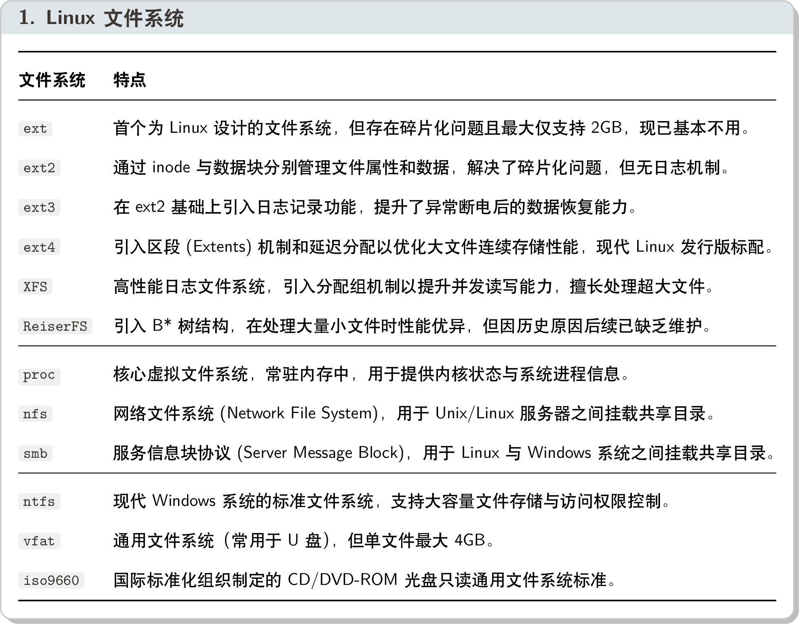
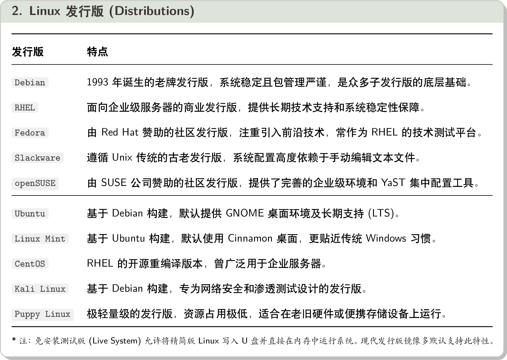
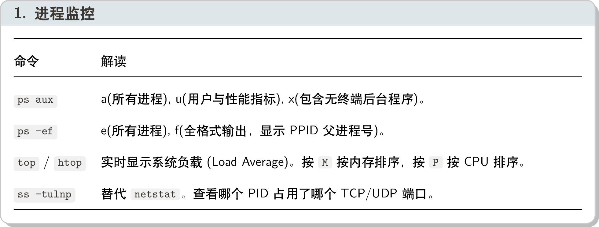
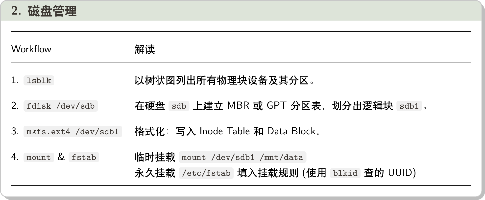
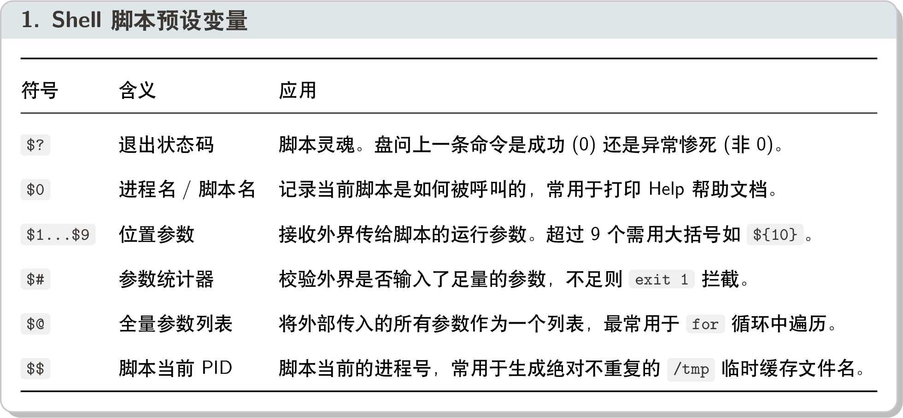
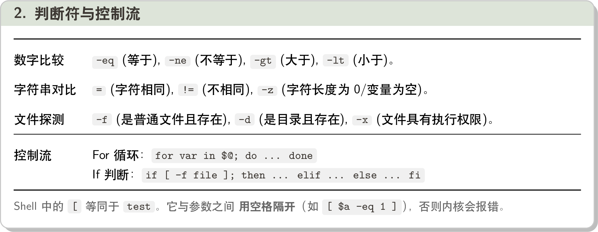
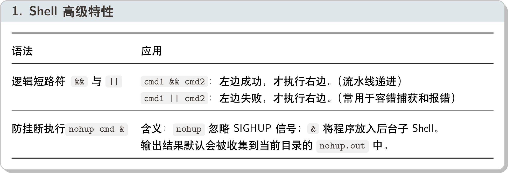
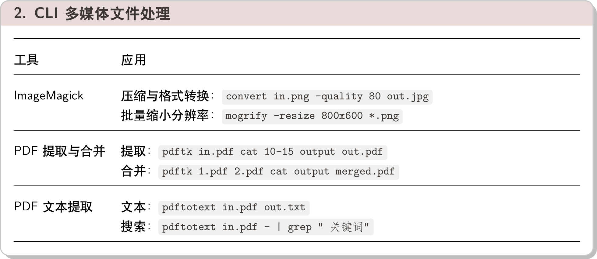

# Linux 核心架构

我们通常所说的 Linux，严格意义上是 Linux 内核 (Kernel) 与 GNU 操作系统工具 的结合体，统称为 GNU/Linux。

一个完整的 Linux 操作系统通常如下图所示，其中 Application Software 也包括图形化桌面环境 (如 GNOME、KDE Plasma)。

<div align="center">
    
</div>

## 1 Linux Kernel 内核

> Linus Torvalds 于 1991 年发布了 Linux 内核的 0.01 版。内核位于计算机硬件与运行库之间，向下制定 Hardware Specification (硬件规范)，向上提供 System Call Interface (系统调用接口)。

内核主要有以下四个核心功能：

- **内存管理**：不仅管理**物理内存 (RAM)**，还负责**虚拟内存**的分配和管理。
- **进程管理**：Linux 将运行中的程序视为**进程 (Process)**，内核负责创建、调度和终止这些进程。
- **设备管理**：内核通过**设备驱动程序 (Driver)** 与计算机的各种硬件设备进行通信和控制。
- **文件系统管理**：通过**虚拟文件系统 (VFS)** 接口统一管理各种文件系统。

1. 内存管理 (Memory Management)

   - 内存管理单元 (MMU)：将物理内存划分为页 (Page)，并通过页表 (Page Table) 实现虚拟地址到物理地址的映射；
   - 缺页异常 (Page Fault)：访问未映射的虚拟地址时，MMU 触发缺页异常，内核会将所需页从磁盘加载回 RAM；
   - 交换区 (Swap Space)：当物理内存不足时，内核会将不常用的数据从 RAM 移动到交换区。

2. 进程管理 (Process Management)

    内核启动后，创建第一个进程 (PID 1)，由其负责拉起和管理所有随开机启动的系统级后台服务。这里经历了重要的历史演进：

    - SysVinit (经典)：通过 `/etc/init.d/` 下的 Shell 脚本串行启动。通过 Runlevel 0-6 来定义系统启动状态。
    - systemd (现代)：通过 `/etc/systemd/system/` 下的 Unit 文件实现服务并行启动。统一使用 `systemctl` 控制。

    > Linux 的思想是“万物皆文件，余者皆进程。” (Everything is a file, the rest are processes.)

3. 设备管理 (Device Management)

    Linux 将硬件设备也视为节点文件 (通常位于 `/dev`)，与设备驱动程序的交互通过读写这些文件来完成。

    - 字符设备 (Character)：每次只能处理一个字符的设备 (如终端、键盘、鼠标)。
    - 块设备 (Block)：每次处理一个数据块的设备 (如硬盘、USB 设备)。
    - 网络设备 (Network)：采用数据包发送和接收数据的设备 (如网卡、回环设备 loopback)。

    > `/dev` 目录下的设备文件通过主设备号 (Major) 和次设备号 (Minor) 来标识设备类型和具体设备。

4. 文件系统管理 (File System Management)

    Linux 有极强的文件系统兼容性。内核通过统一的虚拟文件系统 (VFS) 接口来管理不同类型的文件系统。

    <div align="center">
        
    </div>

## 2 GNU Tools

Linux 内核提供底层系统 (内核空间)，GNU (GNU is Not Unix) 提供用户空间下的工具和库，两者共同构成 Linux 操作系统。

1. GNU 工具链 (GNU Toolchain)

    包括编译器 (GCC)、调试器 (GDB)、构建工具 (Make)、命令行工具 (coreutils)等，是开发 Linux 应用程序的基础。

    - 文件处理：`ls, cp, mv, rm, find` ...
    - 文本处理：`cat, grep, sed, awk` ...
    - 系统监控：`ps, top, free, df, kill` ...

2. Shell

    Shell 是用户与操作系统交互的命令行界面。常见有 Bash, Zsh, Fish 等。Shell 既是一个命令解释器，也是一种脚本语言。

3. Linux 桌面环境

    包括 GNOME, KDE Plasma, Xfce 等，本质是运行在 Linux 上的应用程序，采用“底层显示协议 + 上层窗口管理器”的架构。

    - 显示协议：X11 (传统)和 Wayland (现代)负责处理输入输出事件和图形渲染。
    - 窗口管理器：如 Mutter (GNOME)和 KWin (KDE)负责管理窗口的布局、装饰和交互。

    > X11 (X.org) 存在性能和安全问题，Wayland 直接由应用程序与显示服务器通信，提升了性能和安全性。

    <div align="center">
        
    </div>

---

# Linux 终端与配置

早期用户与 Unix 系统交互只需要一个由键盘和单色显示器组成的哑终端 (Dumb Terminal)，即只负责输入输出，无计算能力。
Linux 保留了这种传统的终端概念，提供了虚拟终端 (Virtual Terminal) 和伪终端 (Pseudo Terminal) 两种进入 CLI 的方式。

但不管哪种终端，在 Linux 内核眼里都是一个字符设备 (Character Device)，设备文件都位于 `/dev` 目录下。

## 1 虚拟终端 (Virtual Terminal)

这是 Linux 内核原生的终端机制，直接与底层的显卡和键盘打交道。

- `/dev/ttyN` (1-6) 切换到不同的虚拟终端，每个终端都独立运行一个登录会话。通常在 tty1 运行图形桌面。
- `/dev/tty0` (全局广播) 映射到当前屏幕正在显示的那个控制台。并且内核崩溃信息会直接输出到 tty0。
- `/dev/tty` (当前终端) 这是一个动态映射指针，永远指向当前进程所在的终端。

## 2 伪终端 (Pseudo Terminal)

伪终端是一种软件模拟的终端，由主设备 (`/dev/ptmx`) 和从设备 (`/dev/pts/N`) 组成。
这是为了在图形桌面 (如 Terminator) 或远程连接 (如 SSH) 环境下模拟终端交互而设计。

- `/dev/ptmx` (多路复用器入口)：每次终端软件打开它时，内核会在内存中动态生成一对主从设备，并将主设备描述符返回给软件。
- `/dev/pts/N` (伪终端从设备)：内核在 `/dev/pts/` 下自动生成的文件。Shell 进程通过它与外部通信，与原生虚拟终端等效。

## 3 Shell 进程

1. 父进程与子进程：在 Linux 中，除了系统初始进程 `systemd`，其余进程都是通过 `fork()` 由父进程克隆出来的**子进程**。
2. 父 Shell 与子 Shell：子 Shell 会继承父 Shell 的全局环境变量和工作目录，但两者**相互独立**。

子 Shell 触发场景：

- **执行 Shell 脚本 (`./script.sh`)**：克隆/开启一个非交互式的子 Shell 来逐行运行代码，不会污染当前终端。
- **命令列表 (`(cmd1; cmd2)`)**：克隆一个子 Shell 执行命令，父 Shell 阻塞等待。
- **后台作业 (`cmd &`)**：克隆一个子 Shell 后台执行命令，父 Shell 立即返回。
- **管道符 (`cmd1 | cmd2`)**：依次克隆两个子 Shell，分别执行 `cmd1` 和 `cmd2`，父 Shell 负责连接它们的输入输出。
- **命令替换 (`$(cmd)`)**：克隆一个子 Shell 执行命令后，将输出结果返回给父 Shell 进行替换。

注意命令列表 `()` 和命令分组 `{}` 的区别在于，命令分组 `{cmd1; cmd2;}` 在当前 Shell 中执行，会污染当前环境。

> 如果 Shell 脚本第一行是 `#!/bin/bash`，则克隆子 Shell 通过 `exec()` 替换为指定的 Shell 解释器来执行脚本内容。

内置命令直接修改当前 Shell 进程的状态；而外部命令则在子进程中执行，不影响父 Shell 环境。(用 `type` 看)

```sh
$ type cd
cd is a shell builtin

$ type ps
ps is /usr/bin/ps          # 外部命令
```

## 4 环境变量与配置文件

变量分为仅当前 Shell 可见的局部变量，以及所有子 Shell 可见的全局变量（需通过 `export` 声明）。

- **查看变量**：`env` 或 `printenv` (仅看全局)、`set` (看所有全局+局部变量)、`declare -p` (查看变量的底层属性)。
- **PATH 变量**：外部命令路径（以 `:` 分隔）。报错 `command not found` 通常是因为命令不在 `$PATH`。

为了让环境配置永久生效，需将其写入配置文件。Shell 会根据启动方式的不同，加载不同的文件：

1. 登录 Shell（如 SSH 登录、Ctrl+Alt+F2 切换控制台）：
   - 1. 全局配置：`/etc/profile`（自动加载 `/etc/profile.d/*.sh`）
   - 2. 用户配置：`~/.bash_profile`（优先）`~/.bash_login`（次选）、`~/.profile`（兼容性考虑）

2. 非登录 Shell：
   - 1. 全局配置：`/etc/bash.bashrc`
   - 2. 用户配置：仅 `~/.bashrc`

> 个人的环境变量和别名（alias）建议统一写入 `~/.bashrc` 中。全局配置则建议在 `/etc/profile.d/` 目录下新建独立脚本。

## 5 番外：Shell 历史记录与快捷符

**内存与磁盘分离**：当前会话的命令暂存在内存中（可用 `history` 查看）；当会话正常关闭时才会同步 `~/.bash_history` 中。

- `!!`：重新执行上一条命令（常用于补加 sudo：`sudo !!`）。
- `!N`：执行历史记录中编号为 N 的命令。
- `!string`：执行历史记录中最近以 string 开头的命令。
- `!$`：引用上一条命令的最后一个参数。
- `^old^new`：将上一条命令中的 old 替换为 new 并执行。
- `Ctrl + R`：开启反向搜索，输入关键词实时匹配历史命令，按 Enter 执行选中命令。

---

# Linux 底层机制

## 1 虚拟目录树

Linux 采用虚拟目录，将所有的物理存储设备拼装成一个统一的“树”，根目录 `/` 是起点。

> **挂载（Mount）**就是将一个外部存储设备上的文件系统，挂载到 Linux 树形目录的某个节点（inode）上。

现代 Linux 目录树的三大核心演进：

- Usr-Merge：现代 `/usr` 目录合并了原本根目录下的二进制和库文件，成为系统软件和库的唯一大本营。
- tmpfs:现代 `/run` 目录用来存放系统运行时的动态数据，并挂载为 tmpfs（内存文件系统），实现断电即焚。
- udev $\rightarrow$ `/dev` $\rightarrow$ `/media`：现代 Linux 通过 udev 动态管理 `/dev` 下的设备节点，并提供 `/media` 用于自动挂载可移动媒体设备。

<div>
    
</div>

## 2 U-G-O 权限模型

Linux 中的一切读写执行行为均由权限位控制。每个用户通过 UID 和 GID 标识身份，系统通过以下文件追踪：

- `/etc/passwd`：存储用户的公开属性（用户名、UID、GID、主目录、默认 Shell）。
- `/etc/shadow`：存储用户的加密密码和安全策略，仅 root 可读写。
- `/etc/group`：存储用户组信息（组名、GID、成员列表）。

> 当一个进程创建一个新文件时，其初始访问权限由该进程的掩码计算得出：`基础全权限 & ~权限掩码 (umask) = 最终默认权限`。

## 3 Unix 哲学

一：每个程序只做好一件事，并且做好它。

比如归档和压缩：`tar` 只负责归档（打包多个文件成一个）；`gzip` 只负责压缩（将单个文件压缩成 .gz）。

二：一切皆文件。包括设备、进程、网络、系统状态。Linux 提供了两个虚拟文件系统：

- `/proc`：内核状态的虚拟文件系统，存在于内存中，以数字命名的文件夹对应着系统中运行的进程 PID。
- `/sys`：以结构化的设备树形式暴露底层硬件和驱动信息，甚至可以通过修改这里的文件来直接控制底层硬件。

三：管道与过滤器。Linux 命令通常输出数据流，用户可以通过管道符 `|` 将命令拼装成流水线。

---

# Linux 文件系统

Linux 内核通过虚拟文件系统 (VFS) 向上提供统一接口，向下兼容各种文件系统格式。

## 1 核心数据结构：Inode 与 Dentry

ext 系统的文件系统在格式化时会被划分为两部分：

- Data Block (数据块)：存储文件的实际内容。(通常为 4KB 大小)
- Inode Table (索引节点表)：每个文件都有一个 Inode，存储数据块指针，以及文件元数据（权限、所有者、大小、时间戳等）。

> ext 文件系统演进过程：
> - 早期 ext：Inode 采用 15 个指针（12个直接 + 3个多级间接）来定位数据块。但这种方式碎片化严重。
> - ext2 引入了 Block Group (块组)，每个块组包含自己的 Inode Table 和 Data Block，减少碎片化。
> - ext3 在 ext2 基础上增加了日志功能，提升了意外断电后的数据恢复速度。
> - ext4 引入了 Extents (区段) 来替代传统的块，Inode 节点改为记录区段的起始位置和长度，提升寻址效率。

目录本质也是一个文件。其 Data Block 中存储 Dentry 目录项（该目录下文件名和其对应的 inode 号）。

## 2 日志 Journaling

当系统意外断电时，Inode 表的修改和数据块的写入如果不同步会导致文件系统崩溃。现代 Linux 主要有两种技术来保证数据安全。

1. 日志 (Journaling)：在修改 Inode 表和数据块之前，先将修改操作记录到一个专门的日志区。主要有三种模式：
   
   - 回写 Writeback：只记录 Inode 表的修改，不记录数据块的修改，性能较高但安全性较低。
   - 有序 Ordered：记录 Inode 表的修改，并确保数据块先写入磁盘后再写入 Inode 表，性能和安全性平衡。
   - 数据 Journal：同时记录 Inode 表和数据块的修改，性能较低但安全性最高。

2. 写时复制 (Copy-on-Write)：在新数据块处写入，修改完成后再更新 Inode 表指向新位置。即使系统崩溃，旧数据仍然完整。

## 3 逻辑卷管理器 (LVM)

在底层物理硬盘与文件系统之间，Linux 引入了一层抽象层——逻辑卷管理器 (LVM) 来实现更灵活的存储管理。主要有三层架构：

- 物理卷 (Physical Volume, PV)：直接对应的底层物理硬盘或分区（如 `/dev/sda1`）。
- 卷组 (Volume Group, VG)：将多个物理卷组合成一个逻辑存储池。
- 逻辑卷 (Logical Volume, LV)：从卷组中划分出来的逻辑存储单元，文件系统就格式化并挂载在 LV 上。

> LVM 允许在系统不停机的情况下，动态扩容 LV 和文件系统。
> 此外，LVM2 支持快速创建只读快照 (Snapshot)。快照卷会记录自创建快照以来的所有写入操作。相当于一个“历史视图”。

---

# Linux 包管理工具

不管是 Debian 系还是 Red Hat 系，Linux 的包管理系统都采用了“前后端分离”设计：

- 后端（本地数据库）：如 `dpkg` 和 `rpm`。负责把 `.deb` 或 `.rpm` 里的文件解压并记录到本地数据库中。
- 前端（依赖解析器）：如 `apt` 和 `yum`。负责先去远程服务器下载清单，再分析依赖项和处理冲突。

当官方仓库缺乏**预编译包**，或需要自定义编译参数时，就需要通过源码压缩包（Tarball）进行编译安装。

Step 1：`./configure` 由开发者提供，探测当前系统的 CPU 架构、GCC 编译器、底层库，生成 Makefile。

Step 2：调用系统底层的 `make` 根据 Makefile 文件将源码文件编译链接为目标文件。

Step 3：`sudo make install` 将目标文件和配置文件复制到系统目录 (默认 `/usr/local/bin` 和 `/usr/local/lib`)

> `/usr/bin` 和 `/usr/lib` 由包管理系统进行管理，避免将其作为手动编译的存放路径。

---

# Linux 核心命令与脚本编程

## 1 文本处理命令

- `grep` 过滤所匹配的行，比如 `grep -E "^(ERROR|FATAL)" app.log`。
- `awk` 一个微型关系型数据库引擎。按行扫描，按条件过滤，按列提取，再进行处理。(分成 `$1, ...` 列)
  比如 `awk -F ':' '$3 > 1000 {print $1}' /etc/passwd` 打印以冒号为分隔，第 3 列大于 1000 的用户名 `$1`
- `sed` 文本流编辑器，在内存中完成“查找与替换”。
  比如 `sed 's/localhost/127.0.0.1/g' config.yml` 将 localhost 换成 IP 地址。

## 2 系统状态监控与设备管理

<div>
    
    <br>
    
</div>

## 3 脚本编程基础

<div>
    
    <br>
    
</div>

## 4 Shell 高级特性

Linux 内核为每一个运行的进程提供了三个输入输出文件描述符，写自动化脚本时可以重定向：

- `0` (Standard Input, stdin) 标准输入（默认从键盘读取）。
- `1` (Standard Output, stdout) 标准输出（默认打印到屏幕的正常信息）。
- `2` (Standard Error, stderr) 标准错误（默认打印到屏幕的报错信息）。

<div>
    
    <br>
    
</div>
